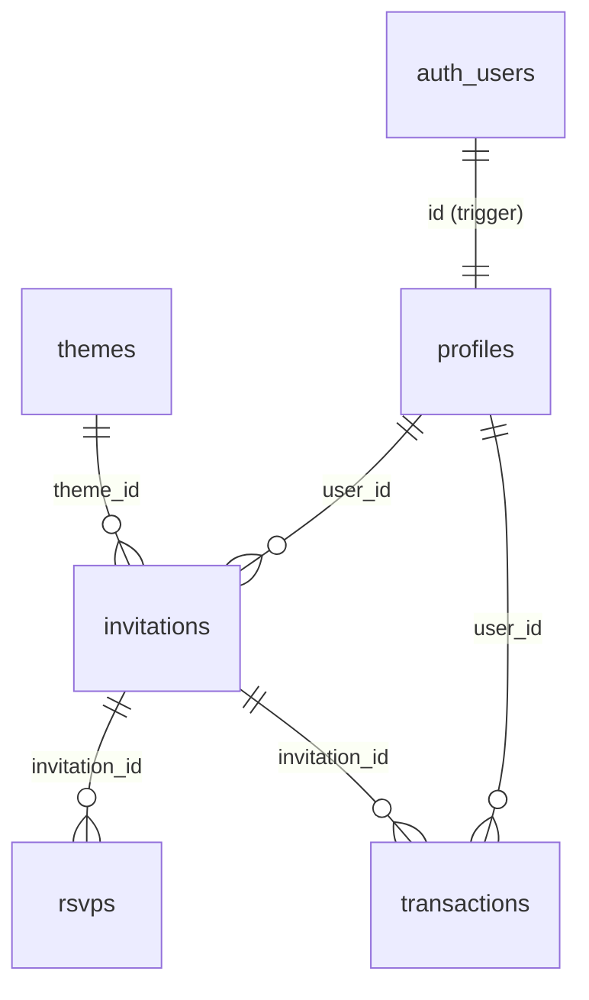

This is a [Next.js](https://nextjs.org) project bootstrapped with [`create-next-app`](https://nextjs.org/docs/app/api-reference/cli/create-next-app).

## Getting Started

First, run the development server:

```bash
npm run dev
# or
yarn dev
# or
pnpm dev
# or
bun dev
```

Open [http://localhost:3000](http://localhost:3000) with your browser to see the result.

You can start editing the page by modifying `app/page.tsx`. The page auto-updates as you edit the file.

This project uses [`next/font`](https://nextjs.org/docs/app/building-your-application/optimizing/fonts) to automatically optimize and load [Geist](https://vercel.com/font), a new font family for Vercel.

## Learn More

To learn more about Next.js, take a look at the following resources:

- [Next.js Documentation](https://nextjs.org/docs) - learn about Next.js features and API.
- [Learn Next.js](https://nextjs.org/learn) - an interactive Next.js tutorial.

You can check out [the Next.js GitHub repository](https://github.com/vercel/next.js) - your feedback and contributions are welcome!

## Deploy on Vercel

The easiest way to deploy your Next.js app is to use the [Vercel Platform](https://vercel.com/new?utm_medium=default-template&filter=next.js&utm_source=create-next-app&utm_campaign=create-next-app-readme) from the creators of Next.js.

Check out our [Next.js deployment documentation](https://nextjs.org/docs/app/building-your-application/deploying) for more details.

# Eventora — Dokumentasi Perancangan Sistem UML

Dokumentasi lengkap perancangan sistem dan arsitektur aplikasi **Eventora** (Platform SaaS Undangan Digital) menggunakan standar UML (*Unified Modeling Language*) dan format **PlantUML (`.puml`)**. Seluruh diagram dirancang berbasis struktur riil codebase Next.js, API routes, database PostgreSQL (Supabase), dan payment gateway Mayar.id.

## 🎨 Panduan Import ke Draw.io

File `.puml` yang telah dibuat dapat langsung di-render ke dalam **Draw.io** / **diagrams.net** dengan langkah-langkah berikut:

### Metode 1: Menggunakan Menu Insert Draw.io (Rekomendasi)
1. Buka [app.diagrams.net](https://app.diagrams.net/) (atau aplikasi desktop Draw.io).
2. Buat diagram baru (*Blank Diagram*).
3. Di menu bar atas, klik **Arrange** (atau ikon **+** di toolbar) $\rightarrow$ **Insert** $\rightarrow$ **Advanced** $\rightarrow$ **PlantUML...**.
4. Buka salah satu file `.puml` di folder `documentation/`, salin seluruh isinya, lalu *paste* ke dalam kotak dialog yang muncul.
5. Klik **Insert**. Draw.io akan mengonversi script PlantUML menjadi diagram visual interaktif yang dapat Anda atur, ubah warna, atau ekspor ke PNG/SVG/PDF.

### Metode 2: Menggunakan PlantText / PlantUML Server
1. Buka [PlantText.com](https://www.planttext.com/) atau [PlantUML Online Editor](https://www.plantuml.com/plantuml/uml/).
2. *Paste* kode dari file `.puml`.
3. Simpan / ekspor gambar ke format **SVG** atau **PNG**.
4. *Drag & drop* file gambar tersebut ke dalam lembar kerja Draw.io.

### Metode 3: Ekstensi VS Code (Opsi Developer)
1. Pasang ekstensi **PlantUML** (`jebbs.plantuml`) di VS Code / Cursor / Windsurf.
2. Buka file `.puml` apa saja di folder `documentation/`.
3. Tekan `Alt + D` (Windows) / `Option + D` (Mac) untuk melihat preview diagram secara live.

---

## 🏗️ Ringkasan Entitas Database (ERD)



---

## 🛡️ Aturan Keamanan & Akses (RLS & Gatekeeping)
- **Undangan Draft vs Aktif**: Undangan yang belum dibayar berstatus `draft` dan diblokir dari akses publik melalui komponen SSR `DraftBlockedPage` dan verifikasi backend di `/api/rsvp`.
- **Row-Level Security (RLS)**: Diaktifkan pada semua tabel (`profiles`, `invitations`, `rsvps`, `transactions`).
- **Webhook Security**: Webhook Mayar divalidasi menggunakan HMAC SHA-256 signature verification via `crypto.timingSafeEqual` sebelum mengeksekusi aktivasi otomatis.
